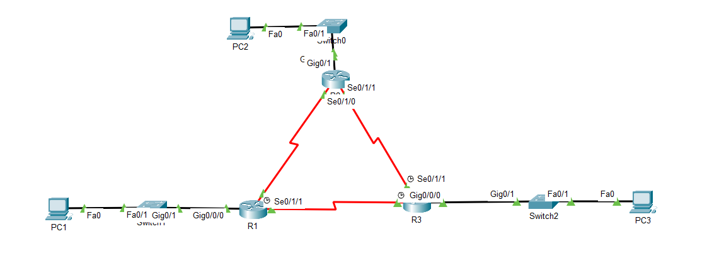

# OSPF Configuration Lab

## 📖 Description
This lab demonstrates the basic configuration of OSPF (Open Shortest Path First) routing between three routers connected in a triangular topology. The lab focuses on establishing OSPF neighbor relationships, advertising networks, and verifying dynamic routing connectivity between different LAN segments.

---

## 🎯 Objectives
- Configure OSPF on multiple routers
- Advertise directly connected networks
- Establish OSPF neighbor adjacency
- Verify dynamically learned routes
- Test end-to-end connectivity between PCs

---

## 🧪 Topology


---

## 🌐 IP Addressing

### R1
| Interface | IP Address |
|---|---|
| G0/0/0 | 172.16.1.17/28 |
| S0/1/0 | 192.168.10.1/30 |
| S0/1/1 | 192.168.10.5/30 |

### R2
| Interface | IP Address |
|---|---|
| G0/0/1 | 10.10.10.1/24 |
| S0/1/0 | 192.168.10.2/30 |
| S0/1/1 | 192.168.10.9/30 |

### R3
| Interface | IP Address |
|---|---|
| G0/0/0 | 172.16.1.33/29 |
| S0/1/0 | 192.168.10.6/30 |
| S0/1/1 | 192.168.10.10/30 |

---

## ⚙️ Technologies Used
- Cisco Packet Tracer
- OSPF Dynamic Routing
- Cisco IOS CLI

---

## ⚙️ Configuration Summary
- Configured IP addressing on all router interfaces
- Enabled OSPF routing process
- Advertised LAN and serial networks into OSPF Area 0
- Verified OSPF neighbor relationships
- Tested routing connectivity between all LANs

---

## 🔍 Verification Commands

```bash
show ip ospf neighbor
show ip route
show ip protocols
show ip interface brief
